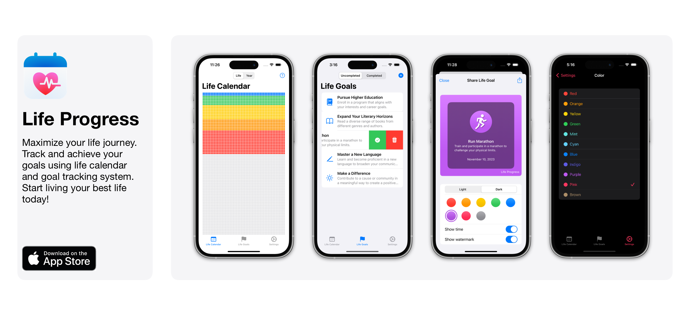

# Life Progress

[](https://developer.apple.com/swift/)
[](https://developer.apple.com/documentation/swiftui)

[](https://developer.apple.com/ios/)
[](https://en.wikipedia.org/wiki/MIT_License)

Welcome to Life Progress, a powerful iOS and iPadOS application designed to help you track your life goals and milestones. Whether you're striving for personal or professional milestones, Life Progress is your ultimate companion on the journey of self-improvement. Start tracking your goals, celebrating your achievements, and living a more fulfilling life with Life Progress.a

[](https://apps.apple.com/us/app/life-progress-calendar/id6447311106)

## Support

Your support help me dedicate more time to enhancing and maintaining this repository. Here's how you can contribute:

- 💵 **Buy Premium**: Consider purchasing the premium version of my application. Your purchase directly supports the ongoing development of this project, allowing me to invest more time and effort into creating valuable content and learning resources centered around The Composable Architecture (TCA).
- ⭐️ **Leave a Star**: If you find this repository useful or interesting, please leave a star on GitHub. Your stars help me gain visibility and encourage others in the community to discover and benefit from this work.
- 📲 **Share with Friends**: If you like the idea behind this project, please share it with your friends, colleagues, or anyone who might find it valuable.
- 🚀 **Get Astro (ASO tool)**: In my journey of developing and enhancing the Life Progress app, I have extensively used Astro, an ASO (App Store Optimization) tool that has significantly contributed to the visibility and success of this project. If you are an app developer looking to elevate your app's performance, I highly recommend giving Astro a try. By using my referral link, you will get access to this powerful tool, and if you decide to purchase it, I will earn a small commission from your purchase. 

🔗 Get Astro with my referral [link](https://tryastro.app?aff=v8EvB)

[](https://tryastro.app?aff=v8EvB)

Thank you for your support!

## Features

- Life Calendar - Monitor your journey and track your progress in life with a visually appealing and easy-to-use life calendar.
- Life Goals Tracking - Set inspiring objectives, pick your goals, and achieve them with our comprehensive life goals tracking system. Celebrate your milestones by viewing completed life goals and successes.
- Theming - Personalize your experience by choosing from a variety of color themes.
- iCloud Sync - Keep your data synced across all your devices with seamless iCloud integration.

## Tech Stack

- **Swift and SwiftUI**: The foundation of the app, Swift and SwiftUI provided a robust and modern development environment, making the coding process efficient and enjoyable.
- **The Composable Architecture (TCA)**: [TCA](https://github.com/pointfreeco/swift-composable-architecture) served as the backbone of the app, offering a predictable and scalable state management system that simplified code organization and facilitated comprehensive testing. Each feature (reducer) in project is thoroughly tested using TCA's [TestStore](https://pointfreeco.github.io/swift-composable-architecture/main/documentation/composablearchitecture/testing), ensuring the reliability and stability of our app.
- **Core Data**: Leveraging Core Data ensured reliable local data persistence, allowing users to access their information seamlessly and consistently.
- **StoreKit2**: StoreKit2 streamlined the management of in-app purchases, providing a secure and user-friendly experience for monetization within the app.
- **WidgetKit**: WidgetKit enhanced the user experience by allowing users to interact with the app directly from their device's home screen, providing quick access to important information.
- **CloudKit**: CloudKit facilitated robust cloud storage and synchronization, enabling seamless data management across devices while maintaining data integrity and security.
- **iPad Compatibility**: The app was optimized for iPad, taking advantage of the larger screen size and delivering an enhanced experience tailored to the device.
- **Secure Analytics**: TelemetryDeck was incorporated to gather valuable insights into user behavior while ensuring the privacy and security of user data. This data-driven approach helped improve the app while maintaining a strong focus on user privacy.


## Getting Started

To launch the app in Xcode, you'll need to obtain the TelemetryDeck API key. You can get a free API key by using [this link](https://dashboard.telemetrydeck.com/registration/organization?referralCode=ND5P0ZA6Q3LUHZSE). By using this link, you'll also receive an additional 100,000 signals per month.


1. From the **Project Navigator** menu, go to **LifeProgress › Dependencies**
2. Open **AnalyticClient.swift**

Make sure to update the configuration in `liveValue`
```swift
let configuration = TelemetryManagerConfiguration(appID: "YOUR_API_KEY")
```

## Contributing

As the solo developer behind Life Progress, I appreciate your interest in contributing! While I handle the project on my own, I'm open to suggestions and feedback. Feel free to reach out with any ideas or proposals. Thank you for your support!

## TODO

- [x] ~~Write TCA store tests~~
- [x] ~~Implement share life goal feature~~
- [ ] Add localizations
- [ ] Add ability to share Life Calendar as an image (Similar to Share Life Goal feature)
- [ ] Implement different types of Life Goals (We should be able to track progress in our goals)


## License

Life Progress is available under the MIT license. See the [LICENSE](https://github.com/AndreasInk/IntroKit/blob/main/LICENSE) file for more info. 

---
Developed with ❤️ by [Bartozo](https://twitter.com/Bartozo_).
